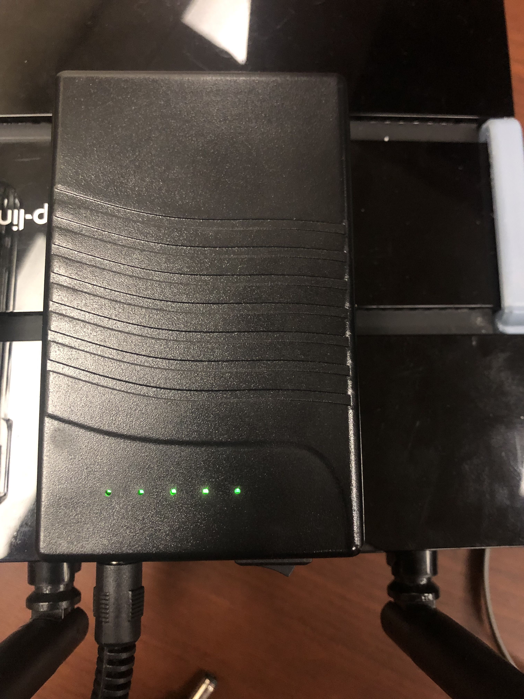

# 1. Table of Contents

- [1. Table of Contents](#1-table-of-contents)
- [2. EMURR Unit](#2-emurr-unit)
  - [2.1. Itemized List](#21-itemized-list)
  - [2.2. Setup](#22-setup)
    - [2.2.1. Battery Power](#221-battery-power)
    - [2.2.2. Connecting Ethernet \& Power Supply](#222-connecting-ethernet--power-supply)
- [3. Tour Site Builder](#3-tour-site-builder)
  - [3.1. Making a Site](#31-making-a-site)
  - [3.2. Transferring Sites to the Pi](#32-transferring-sites-to-the-pi)

 

# 2. EMURR Unit

## 2.1. Itemized List

What is in an EMURR Unit?

- Raspberry Pi
  - Power Cable
  - Micro SD Card Operating System
- Battery
- TP Link Router
  - Power Cable
  - Backpack Mount
  - Battery & Raspberry Pi Mount
- Ethernet Cable

<!-- TODO: CHDR contact -->

If any parts are missing, damaged, or malfunctioning please contact CHDR labs.

## 2.2. Setup

### 2.2.1. Battery Power

1. Turn on battery
2. Ensure battery shows four solid green lights. This indicates a full charge.     

### 2.2.2. Connecting Ethernet & Power Supply

1. Ethernet cable from Pi to the router. Ensure that the ethernet cable from the Pi goes to one of the orange ethernet ports and **Not** the blue internet port.     
2. Power from battery to router
   1. Connect power supply from battery to router
   2. Turn on router by pressing the power button on the back side.     
   3. Verify the router is powered by all lights turning on followed by a blinking green power light.     
   4. Wait ~15 seconds for the two wi-fi lights. This indicates wi-fi is being provided at `TP-Link_EMURR` or `TP-Link_EMURR_5G`.     
      > Note: You can also use `TP-Link_EMURR` but we have seen less issues when using the 5G counterpart.
3. Power from battery to Pi

   1. Connect the Pi to the battery using a USB to micro-USB cable   
   2. Ensure the Pi is powered on by seeing a solid red LED light in the front    > Note: if the red (right, closest to micro-USB port) LED is blinking this implies a low voltage.

 

# 3. Tour Site Builder

## 3.1. Making a Site

1. Navigate to the EMURR website [chdr.cs.ucf.edu/emurr](https://chdr.cs.ucf.edu/emurr)
2. Click `Login` at the top right if not already logged in
   1. If this is your first time, either register on the left-hand side or authenticate on the right
   2. Otherwise, you can login on the left or also authenticate on the right
3. Click profile picture at the top right
   1. Select `dashboard` in the drop down
4. Click `Create a New Tour`
5. You should be brought to the tour editor
   1. If not, click `Edit` on the new tour's card
6. Change the tour name as desired at the top left
7. Add new pages on the sidebar by clicking `Create New Page`
8. Edit pages by clicking on the name `Untitled`
9. Edit page names as desired by hovering the page and clicking `Edit`. When done click `Save`
10. To change the URL that pages will be displayed at select the `link icon` on the page
    1. Note: This is only the end of the URL. See [Transferring Sites to the Pi](#transferring-sites-to-the-pi) for more detail
    2. If there is no custom URL one will be assigned based on the page's hidden ID. See [Transferring Sites to the Pi](#transferring-sites-to-the-pi) for more detail
11. Create your pages as desired in the editor
12. Ensure to save pages at the top `Save` button regularly to not lose changes

 

## Editor Features List

**From Left to Right**

- Heading
- Font
- Common Text Edits
  - Bold
  - Italic
  - Underline
  - Strikethrough
  - Subscript
  - Superscript
  - Font
  - Highlight
- Text Placement
  - Left
  - Center
  - Right
  - Inline
- Code Block
- Bullet List
- Ordered List
- Block Quote
- Horizontal Rule
- Table Actions
- Insert Image or Video
- Clear Format
- Undo
- Redo

 

## 3.2. Transferring Sites to the Pi

1.  To perform a transfer, move the downloaded folder to a USB stick
<!-- TODO: explain why toursite -->
2.  Ensure the folder downloaded is named "toursite"
3.  Plug the USB into the Raspberry Pi
4.  Wait until the green LED stops flashing
5.  When the LED stays lit the tours are transferred. Unplug the USB.
    1.  If the LED does not stop blinking or does not stay lit there has been an error. Try Again.
6.  Tours are now accessible on the `TP-LINK_EMURR_5G` wi-fi. Connect to it to test.
7.  To find the directory of all pages go to the URL `emurr.local/toursite`
8.  Pages will be accessible at the URL `emurr.local/toursite/<custom-url>` without `<` and `>`.
9.  If using NFC tags, ensure they point to the correct URL formatted in the previous step
    1.  Visiting institutions should set their NFC tags before arrival. Request their EMURR NFC Tag URLs to ensure you have the correct URLs for your tour.
